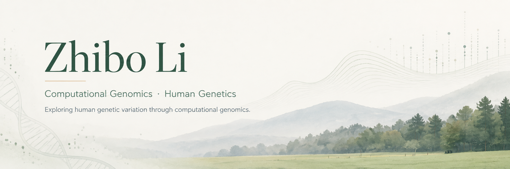

  

  <b>English</b> · <a href="README.zh-CN.md">中文</a>

## 🌱 A little about me

Hi, I'm Zhibo 👋 I'm a computational genomics researcher who likes digging into genomic data and figuring out what biological story it can tell.

I started out in **evolutionary and population genomics**, working on genome evolution, population structure and adaptation. These days, I spend more of my time around **human genetics, cancer genomics and long-read sequencing**.

I'm especially curious about how genetic variation shapes **evolution, complex traits and disease** — across individuals, populations and species.

> A genomics journey from plants, to birds, to humans 🌱🐦🧬

---

## 🔭 Things I'm curious about

`Human genetics` · `Statistical genetics` · `Long-read genomics` · `Population & evolutionary genomics` · `Cancer genomics`

---

## 🔬 A few things I've worked on

- 🧬 **[Somatic Variant Workflow](https://github.com/lizhibo-nevaeh/somatic-variant-workflow)**  
  A modular Snakemake workflow for paired tumor-normal WES/WGS analysis.

- 🌿 **[Population Genomics Workflow](https://github.com/lizhibo-nevaeh/population-genomics-workflow)**  
  Population structure, phylogeny, demographic history, LD decay and selection scans.

- 🌊 **[HiFi Germline Workflow](https://github.com/lizhibo-nevaeh/hifi-germline-workflow)**  
  PacBio HiFi germline analysis with DeepVariant, Sniffles2, GLnexus and relatedness QC.

- ⚡ **[Short-Read Germline Workflow](https://github.com/lizhibo-nevaeh/short-read-germline-workflow)**  
  Two routes for short-read germline analysis: GATK on CPU and DeepVariant/GLnexus with GPU acceleration.

---

## 🌱 Independent learning projects

Outside my current work, I've been using small hands-on projects to learn more about statistical genetics.

- 📊 **[Exploring Polygenic Risk Scores](https://github.com/lizhibo-nevaeh/exploring-polygenic-risk-scores)**  
  A step-by-step learning project exploring PRS concepts, from basic scoring and allele harmonisation to C+T, PRSice-2, LDpred2 and PRS-CS, followed by a genome-wide CAD case study using public data.

- 🧬 **[GWAS–eQTL Coloc & MR Learning Project](https://github.com/lizhibo-nevaeh/gwas-eqtl-coloc-mr-sort1-cad)**  
  A hands-on learning project using a SORT1–CAD example to explore GWAS/eQTL summary statistics, allele harmonisation, colocalisation, LD clumping and Mendelian randomisation.

---

## 🛠️ My toolbox

**Genomic analysis**

`GATK` · `DeepVariant` · `GLnexus` · `Sniffles2` · `bcftools` · `VEP` · `Truvari`

**Population & evolution**

`PCA / ADMIXTURE` · `Fst / π / Tajima's D` · `PSMC` · `PLINK` · `RAxML-NG` · `BEAST`

**Computing & workflows**

`Python` · `R` · `Bash` · `Linux / HPC` · `SLURM` · `Snakemake` · `Docker / Apptainer`

**Statistical genetics**  

`GWAS` · `eQTL` · `coloc` · `MR` · `PRS` · `LD` · `PLINK2`

---

  <i>🌿 Still learning, still curious.</i>

